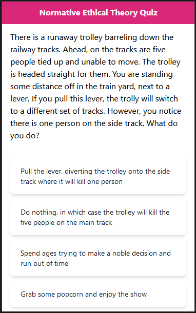

# Normative Ethical Theory Quiz

Based on the tongue-in-cheek quiz by Oliver Lugg in his video [FTL: Trolley
Problems in Space (Video Game
Analysis)](https://www.youtube.com/watch?v=L2HpA5u5qKc).

One of the main areas of Philosophical Ethics is called Normative Ethics. Here,
we choose the factors we value in making decisions.

By teasing out the reasons why we make a decision, we can better define right
and wrong to improve our understanding of complex situations.

Normative Ethics is all about determining the intrinsic factors - figuring out
the most basic reasons why an action or rule has ethical force. Whatever
conclusion you come to is considered a Normative Theory.

This quiz asks questions and then shows which Normative Ethical Theory the
answerer most aligns with.

[Take the quiz!](https://netquiz-ecb002.netlify.app/)

[](https://netquiz-ecb002.netlify.app/)

## Development

Clone this repository

```sh
git clone https://github.com/travishorn/netquiz
```

Change into the directory

```sh
cd netquiz
```

Install dependencies

```sh
npm install
```

Run the development server

```sh
npm run dev
```

The quiz will be available and hot-reloadable at http://localhost:5173

## Deployment

Build the static-site for production

```sh
npm run build
```

Serve the files in the `./dist` directory.

## License

The MIT License (MIT)

Copyright © 2023 Travis Horn

Permission is hereby granted, free of charge, to any person obtaining a copy of
this software and associated documentation files (the “Software”), to deal in
the Software without restriction, including without limitation the rights to
use, copy, modify, merge, publish, distribute, sublicense, and/or sell copies of
the Software, and to permit persons to whom the Software is furnished to do so,
subject to the following conditions:

The above copyright notice and this permission notice shall be included in all
copies or substantial portions of the Software.

THE SOFTWARE IS PROVIDED “AS IS”, WITHOUT WARRANTY OF ANY KIND, EXPRESS OR
IMPLIED, INCLUDING BUT NOT LIMITED TO THE WARRANTIES OF MERCHANTABILITY, FITNESS
FOR A PARTICULAR PURPOSE AND NONINFRINGEMENT. IN NO EVENT SHALL THE AUTHORS OR
COPYRIGHT HOLDERS BE LIABLE FOR ANY CLAIM, DAMAGES OR OTHER LIABILITY, WHETHER
IN AN ACTION OF CONTRACT, TORT OR OTHERWISE, ARISING FROM, OUT OF OR IN
CONNECTION WITH THE SOFTWARE OR THE USE OR OTHER DEALINGS IN THE SOFTWARE.

[Favicon created by kmg design - Flaticon](https://www.flaticon.com/free-icons/philosophy)
